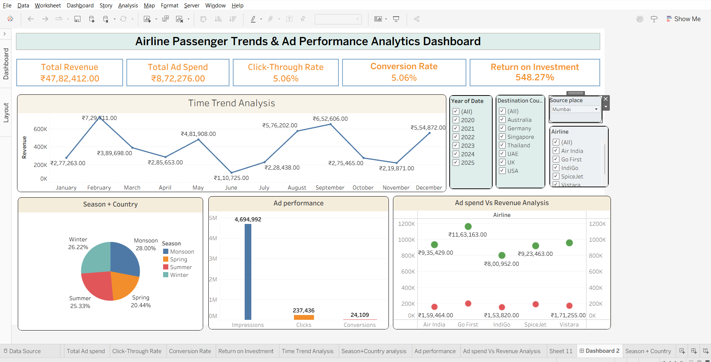

# ✈️ Airline Trends & Ad Performance Analytics Dashboard (Tableau)

## 🔍 Overview

This project presents an interactive Tableau dashboard analyzing airline passenger trends alongside advertising performance metrics. It provides insights into revenue patterns, marketing effectiveness, and overall business profitability.

---

## 🎯 Business Problem

Airlines need to understand:

* Changing passenger demand trends
* Effectiveness of marketing campaigns
* Relationship between ad spend and revenue
* Customer behavior across seasons and regions

This dashboard helps in making data-driven decisions for optimizing marketing and improving revenue.

---

## 🚀 Key Features

* 📊 KPI tracking (Revenue, Ad Spend, CTR, Conversion Rate, ROI)
* 📅 Time-series analysis of revenue trends
* 🌍 Country & seasonal passenger analysis
* 📉 Funnel analysis (Impressions → Clicks → Conversions)
* 📈 Scatter plot for Ad Spend vs Revenue

---

## 🛠 Tools & Technologies

* Tableau
* Data Visualization
* KPI Modeling
* Business Analytics

---

## 📊 Key Metrics & Calculations

* **Total Revenue** = SUM(Revenue)
* **Total Ad Spend** = SUM(Ad Spend)
* **CTR** = SUM(Clicks) / SUM(Impressions)
* **Conversion Rate** = SUM(Conversions) / SUM(Clicks)
* **ROI** = SUM(Revenue) / SUM(Ad Spend)

👉 These KPIs provide a high-level view of performance and campaign effectiveness 

---

## 📈 Key Insights

### 1. Revenue Trends

* Monthly revenue trends reveal fluctuations in demand
* Peak periods indicate strong seasonal travel behavior

### 2. Ad Performance

* Funnel analysis highlights drop-off from impressions to conversions
* Identifies opportunities to improve ad engagement

### 3. ROI Analysis

* Comparison of Ad Spend vs Revenue helps evaluate campaign efficiency
* Certain campaigns generate higher returns with optimized spend

### 4. Season & Country Trends

* Passenger demand varies across countries and seasons
* Helps identify high-demand regions and peak travel periods

---

## 📊 Business Impact

* Improved understanding of customer travel behavior
* Enabled optimization of marketing spend
* Supported data-driven campaign decisions
* Identified opportunities to increase conversion rates

---

## 📂 Project Files

* Tableau Workbook (.twb)

---
  ## 🖼 Dashboard Preview

---

## 📌 Future Enhancements

* Real-time data integration
* Predictive analytics for demand forecasting
* Customer segmentation using advanced analytics

---

## ⭐ Support

If you found this project useful, consider giving it a ⭐!

---

## 👩‍💻 Author

**Nirosha Naik**
